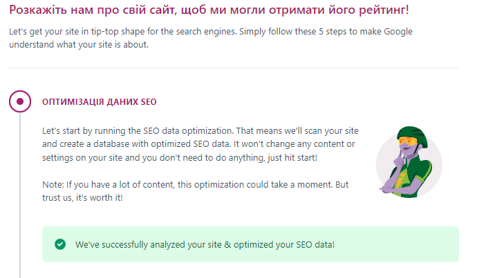
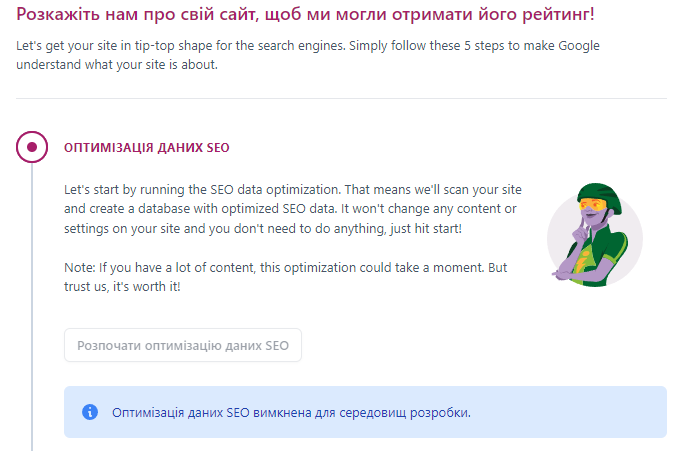

## Example Screenshots with Yoast SEO:


<!---->

# Disabling Developer Mode in LocalWP

LocalWP automatically sets the WordPress environment type to 'local' in the `wp-config.php` file, indicating a development environment. If you want to prevent this setting or automatically remove it, follow these steps:

## Step 1: Block Changing WP_ENVIRONMENT_TYPE

Before the line `define( 'WP_ENVIRONMENT_TYPE', 'local' );` in your `wp-config.php`, add the following code:

```php
// Blocking changes to WP_ENVIRONMENT_TYPE
if (defined('WP_ENVIRONMENT_TYPE') && WP_ENVIRONMENT_TYPE === 'local') {
    exit;
}
```

## Step 2: Automatically Remove WP_ENVIRONMENT_TYPE

Add the following code at the end of your theme's `functions.php` file:

```php
// Automatic removal of define( 'WP_ENVIRONMENT_TYPE', 'local' ); from wp-config.php
function remove_wp_environment_type() {
    // Get the content of wp-config.php
    $wp_config = file_get_contents(ABSPATH . 'wp-config.php');

    // Replace the line define( 'WP_ENVIRONMENT_TYPE', 'local' ); with an empty string
    $wp_config = preg_replace("/define\(\s*'WP_ENVIRONMENT_TYPE',\s*'local'\s*\);\s*/", '', $wp_config);

    // Write the updated content back to wp-config.php
    file_put_contents(ABSPATH . 'wp-config.php', $wp_config);
}

// Run the function during WordPress initialization
add_action('init', 'remove_wp_environment_type');
```

Remember to test these changes in a safe environment before applying them to a production site.
